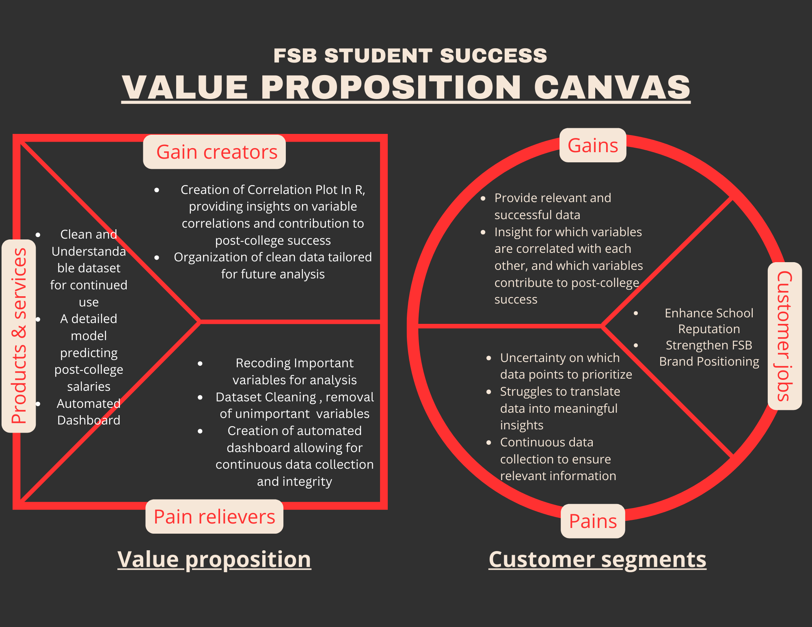

```{r setup, include=FALSE}
knitr::opts_chunk$set(echo = TRUE)
```


# Business Value Proposition

## Descriptive Summary

### Define the client or audience for your data analysis solution. 

Kirk Bogard / FSB (Farmer School of Business)
Kirk Bogard is responsible for leading a team of dedicated professionals focused on the marketing and communications for the Farmer School of Business. His responsibilities include career and professional development programming for students, alumni engagement, corporate relations, and event management.

### Define the client jobs.  What jobs are your clients trying to get done?  Use a separate bullet point for each job you intend to help your client get done.  

* Increase School Reputation/Prestige: Enhance FSB’s public perception by showcasing successful student outcomes.
* Improve Communication with Stakeholders: Effectively communicate FSB’s successes to prospective students, parents, alumni, and corporate partners.
Support Career Development: Provide data to influence programming and ensure alignment with industry expectations.
* Attract Employers: Use data to demonstrate FSB graduates' preparedness and competence to potential recruiters.
* Drive Data-Informed Decisions: Leverage data to influence decisions about curriculum, programming, and marketing strategies.

### Add pains. What are the pains before, during, and after your client is trying to get their jobs done?  Create a bullet point for every specific pain.

**Before:**
Uncertainty on which date points to prioritize and which metrics reflect the most insights
Uncertainty on how to present the data in a way that positively impacts FSB’s reputation

**During:**
Difficulty benchmarking FSB’s performance against other business schools due to data availability
Struggles to translate data into meaningful insights that demonstrate the value and success of FSB programs

**After:**
Need for continuous data collection and updates to ensure information remains relevant and updated 
Responding to stakeholder feedback and adapting strategies based on student/employer concerns
Difficulty in maintaining engagement of stakeholders once initial data and reports have been shared

### Describe your intended solution. Give a bullet point for each major element of your product or solution.

* Develop an interactive dashboard that consolidates key metrics and allows FSB to access and present real-time data to stakeholders
* Provide a comparative analysis that benchmarks FSB’s performance against competitor institutions, helping to identify strengths and areas of improvement in program offerings
* Establish feedback loop with stakeholders to continuously refine data collection, reporting, and communication processes

### What are the painkillers from your solution? You should be able to map a pain killer to a client's pain.

* Prioritizing certain variables that provide valuable insight, allowing users to make new predictions to benefit FSB
* Providing structured and complete data, and setting up the path for data analysis and value proposition
* Identifying key metrics that signify the importance and success of FSB’s majors and programs, which can be used for external marketing

### Add gains. What else might your solution deliver that will surprise or benefit your client above and beyond simply killing their pain?

* Provide valuable insights into which variables are strong predictors of post-college success, helping FSB optimize program offerings and improve graduate outcomes.
* Enable data-driven decision-making that directly improves FSB’s ability to meet student and employer expectations.

### What are the gain creators? You should be able to map a gain creator to a client gain.

* Aggregating data from multiple sources ensures a comprehensive view of student success metrics.
* Help FSB better understand which dataset predictors are most impactful for student success, guiding future program adjustments.
* The solution will streamline ongoing data collection, ensuring consistent and up-to-date information for long-term use.

## BVP Diagram

```{r}

```

# Data Cleaning

## Importing Libraries and Load Dataset

```{r}
# Loading necessary libraries for data analysis and visualization
library(tidyverse)  # Includes ggplot2, dplyr, and other useful packages for data analysis
library(readr)      # For reading CSV files
library(ggplot2)    # For plotting

# Reading the dataset from a CSV file
df <- read_csv('C:/Users/nicko/Downloads/SS_2019_2021.csv')

# Displaying the first few rows of the dataset
head(df)
```

We use read_csv from the readr package in R to read the CSV  file. The tidyverse package contains many useful functions for data manipulation and visualization.

## Check Dataset Length

```{r}
# Checking the total number of rows in the dataframe
nrow(df)
```

This step helps us understand the size of the datset and ensure that all data has been successfully loaded.

## Check for Missing Values

```{r}
# Checking for missing values in the dataset
colSums(is.na(df))
```

This step is critical in the data cleaning process as it allows us to see which columns contain missing values, which will need to be addressed through imputation, removal, or other strategies.

```{r}
# Dropping rows where both 'survey_salary' and 'survey_plans' columns have missing values
df <- df[!(is.na(df$survey_salary) & is.na(df$survey_plans)), ]

# Rechecking for missing values after dropping rows
colSums(is.na(df))
```

This step addresses missing data by dropping rows with missing values in specific columns. Here, the code removes rows where both “survey_salary” and “survey_plans” are missing, ensuring that incomplete records in these key fields are excluded. It then rechecks the missing values to confirm the changes.

## Correlation Matrix Heatmap

```{r}
# Generating a correlation matrix for numerical columns
num_cols <- df %>% select(where(is.numeric))  # Selecting only numerical columns
corrmat <- cor(num_cols, use = "complete.obs")  # Correlation matrix ignoring missing values

# Plotting the correlation matrix using ggplot2 and geom_tile()
install.packages("reshape2")
library(reshape2)  # For reshaping the correlation matrix for ggplot2

melted_corrmat <- melt(corrmat)  # Melting the correlation matrix to a long format for heatmap
ggplot(data = melted_corrmat, aes(x=Var1, y=Var2, fill=value)) +
  geom_tile() +
  scale_fill_gradient2(low="blue", high="yellow", mid="white", midpoint=0) +
  theme_minimal() +
  theme(axis.text.x = element_text(angle = 90, hjust = 1))
```

This step helps in identifying relationships between numerical variables, allowing us to see which features may be more strongly correlated and could potentially be dropped or transformed in the data pre-processing steps.

## Drop High Correlation Variables

```{r}
# Dropping columns 'University Honors' and 'Term.Code' from the dataframe
df <- df %>% select(-`University Honors`, -`Term.Code`)
```

We decided to drop the variables "University Honors" and "Term.Code" from the dataset because they exhibited high correlations with other variables, as observed in the correlation heatmap. "University Honors" was strongly correlated with other academic achievement indicators such as "Summa Cum Laude" and "Dean's List," suggesting redundancy in the data. Similarly, "Term.Code" showed a high correlation with "year.x," which captures related time-based information. To avoid multicollinearity—where multiple variables provide overlapping information—these variables were removed. This step simplifies the dataset and helps ensure that any subsequent analysis or modeling is not biased or distorted by redundant features, leading to more reliable results.

## Further Assess Correlation

```{r}
# Calculate the correlation between 'survey_salary' and other numerical variables
correlation_with_salary <- df %>%
  select(where(is.numeric)) %>%  # Select only numerical columns
  cor(use = "complete.obs") %>%   # Calculate correlation matrix, ignoring missing values
  .[, "survey_salary"] %>%        # Extract correlation with 'survey_salary'
  sort(decreasing = TRUE)         # Sort values in descending order

# Print the correlation values
print(correlation_with_salary)
```

This code calculates the correlation between the survey_salary variable and all other numerical variables in the dataset. It then sorts the correlation values in descending order and prints them, allowing us to see which variables are most strongly correlated with survey_salary.

## Further Dropping Variables

```{r}
# Dropping specified columns in R
df <- df %>% select(-`Cum Laude`, -`Magna Cum Laude`, -`Summa Cum Laude`,
                    -`survey_internone`, -`survey_interntwo`,
                    -`survey_internthree`, -`survey_internfour`, -`survey_state`)
```

We dropped these variables for the following reasons:
* **Cum Laude, Magna Cum Laude, Summa Cum Laude**: These variables are highly correlated with each other (as seen in the correlation results), indicating redundancy. Keeping all of them would introduce multicollinearity into the analysis.
* **survey_internone, survey_interntwo, survey_internthree, survey_internfour**: These variables might have little to no correlation with survey_salary or other key variables, contributing minimal useful information.
* **survey_state**: If this variable has no meaningful correlation or provides redundant location-based information, it may be unnecessary for further analysis.

By dropping these variables, we reduce multicollinearity and simplify the dataset to focus on more relevant features.

## Final Dataset Overview

```{r}
# Checking the structure of the dataframe
str(df)
```

The str() function in R provides an overview of the dataset, including the number of rows, columns, data types, and the count of non-null values for each column. This step is essential for understanding the structure of the dataset before proceeding with further analysis. It helps identify missing values that may require handling, incorrect data types that might need conversion, and any inconsistencies that could affect the quality of the analysis or modeling. By reviewing this information, we can make informed decisions about necessary data cleaning, such as imputing missing values or transforming variables, to ensure the dataset is in optimal shape for analysis.

```{r}
# Using the built-in summary() function to show summary statistics
summary(df)
```

This cell uses the built-in summary() function in R to display key summary statistics for each variable in the dataset. For numerical variables, it provides values such as the minimum, maximum, mean, median, and quartiles, offering insight into the data distribution. For categorical variables, it shows the class, mode, and frequency of the most common values. This is the final step in the data cleaning and preprocessing process because it allows us to verify the integrity of the data, ensuring there are no unexpected outliers or data distribution issues. It also confirms that missing values have been handled appropriately and that the dataset is now clean, well-structured, and ready for further analysis or modeling.

## Export Clean Data

```{r}
write.csv(df, "clean_student_success_data.csv")
```

This exports our cleaned data into a new csv file that will be used for our analysis in the dashboard.
